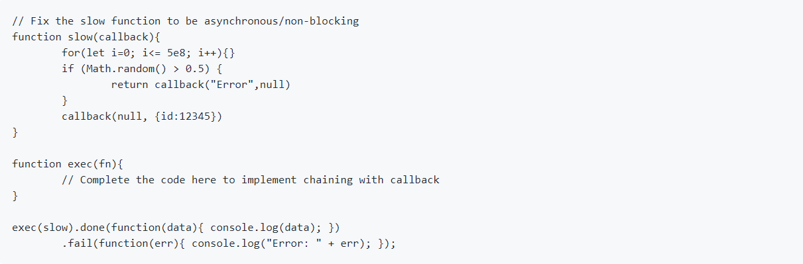

# Lab 1
## Exercise 1
### JS file attached
Write the necessary Node script to make this code work for all arrays:
[1,2,3,4,5,6,7,8].even(); // [2,4,6,8]
[1,2,3,4,5,6,7,8].odd(); // [1,3,5,7]
Test your code in Node.JS CLI

## Exercise 2 Q & Answer
1. Explain why do we want sometimes to use setImmediate instead of using setTimeout? 

 SetImmediate: It gets executed in the "check" phase. The check phase is called after the I/O phase. SetTimeOut: It gets executed in the "timer" phase. The timer phase is the first phase but is called after the I/O phase as well as the Check phase.

2. Explain the difference between process.nextTick and setImmediate?

Process.NextTick() would executed at next tick of event loop. However, the setImmediate, basically has a separate phase which ensures that the callback registered under setImmediate() will be called only after the IO callback and polling phase.

3. Name 10 global modules/methods available in Node environment.

buffer,
console, 
exports, 
setImmediate(), 
clearImmediate(), 
clearInterval(), 
ClearTimeOut(), 
setInterval(), 
setTimeout(), 
queueMicrotask(), 
textDecoder, 
class URL
	

 

## Exercise 3 (Optional)

### JS file attached.

